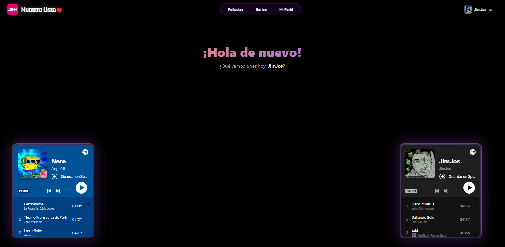
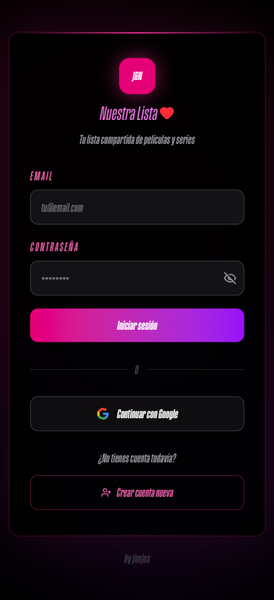
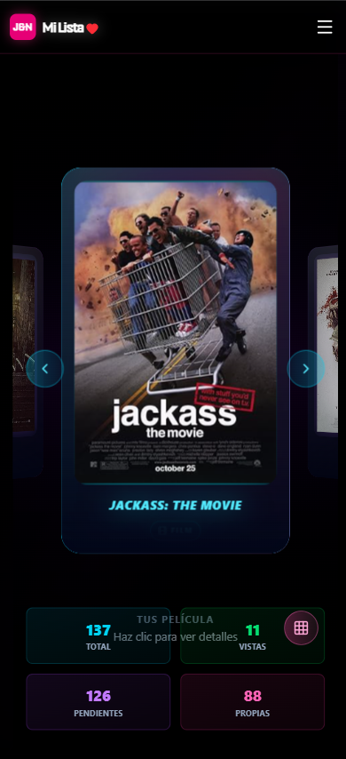
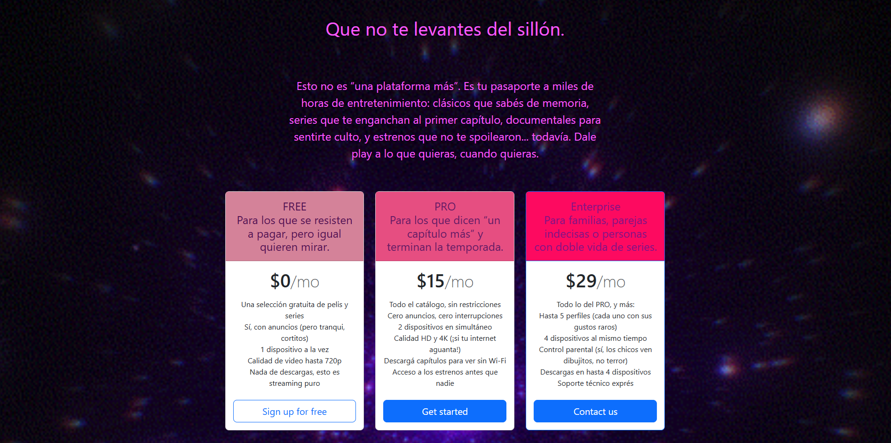
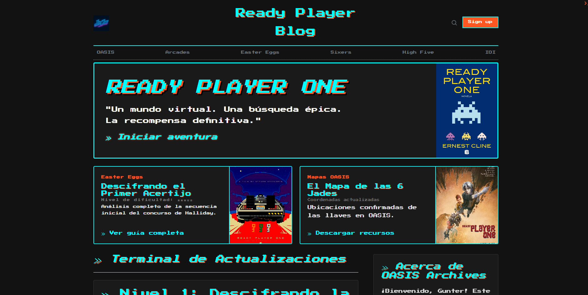

<!-- Cyberpunk / Neonwave README (stable, minimal external deps) -->

<h1 align="center">JimJos Calderon</h1>

<b>DAM Student · Intern · Neonwave / Cyberpunk vibes</b>

  

  

  

## 👾 Sobre mí | About me
Soy Jimmy Calderón, estudiante de **Desarrollo de Aplicaciones Multiplataforma (DAM)** y actualmente estoy realizando mis **prácticas**.  
I’m a **Cross-Platform Application Development (DAM)** student and I’m currently doing my **internship**.

- 📍 España | Spain  
- 🧠 Enfocado en | Focused on: responsive web apps, UI, buenas prácticas  
- ⚙️ Stack favorito | Favorite stack: TypeScript + React/Angular + Node.js

---

## 🧷 Badges | Tech stack

### Frontend

### Backend

### DevOps / Tools

---

## 🌌 Proyectos | Projects

### J&N (responsive)
**Live:** https://jandn.onrender.com

<table>
  <tr>
    <td>
      
      
      
    </td>
  </tr>
</table>

<table>
  <tr>
    <td width="49%">
      
      
      
    </td>
    <td width="49%">
      
      
      
    </td>
  </tr>
</table>

---

### Pricing
**Live:** https://pricing-fxsd.onrender.com/

<table>
  <tr>
    <td>
      
      
      
    </td>
  </tr>
</table>

---

### ReadyPlater Blog
**Live:** https://readyplaterblog.onrender.com/

<table>
  <tr>
    <td>
      
      
      
    </td>
  </tr>
</table>

---

## 📡 Contacto | Contact
- GitHub: https://github.com/JimJos-Calderon  
- Email: **jimjos.calderon@gmail.com**

  

