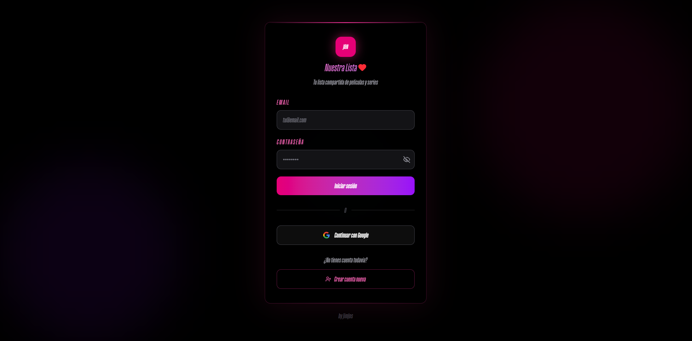
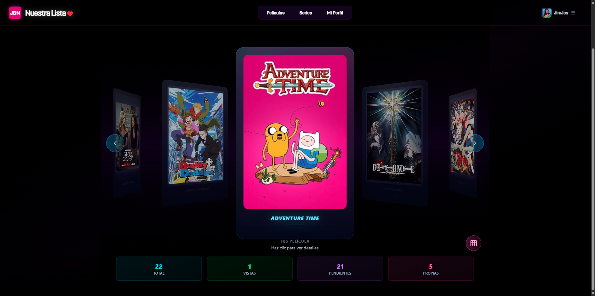

  

  

  

<!-- Reusable "glow frame" for images: GitHub README supports inline HTML style -->
<!-- Night-blue base + cyan/magenta neon glow -->
<!-- Use like:  -->

## 👾 Sobre mí | About me
Soy estudiante de **Desarrollo de Aplicaciones Multiplataforma (DAM)** y actualmente estoy realizando mis **prácticas**.  
I’m a **Cross-Platform Application Development (DAM)** student and I’m currently doing my **internship**.

- 📍 España | Spain  
- 🧠 Enfocado en | Focused on: responsive web apps, UI, buenas prácticas  
- ⚙️ Stack favorito | Favorite stack: TypeScript + React/Angular + Node.js

---

## 🧷 Badges | Tech stack

### Frontend

### Backend

### DevOps / Tools

---

## 🌌 Proyectos | Projects

<!-- Glow style (copy/pasted per image because GitHub markdown doesn't support variables) -->
<!-- border + neon box-shadow -->
<!-- Tip: keep max-width percentages as-is for responsive layout -->

### J&N (responsive)
**Live:** https://jandn.onrender.com

  

  

  

  
  

---

### Pricing
**Live:** https://pricing-fxsd.onrender.com/

  

---

### ReadyPlater Blog
**Live:** https://readyplaterblog.onrender.com/

  

---

## 📡 Contacto | Contact
- GitHub: https://github.com/JimJos-Calderon  
- Email: **jimjos.calderon@gmail.com**

---

## 📈 Stats (opcional)

  
  

  

